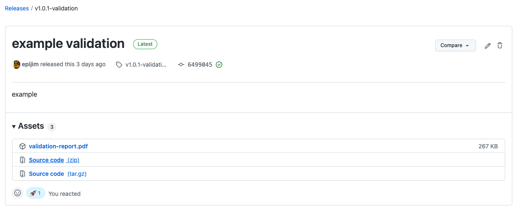

# thevalidatoR

 

[](https://pharmaverse.org)
[](https://github.com/insightsengineering/thevalidatoR/actions/workflows/lint.yaml)
[](https://github.com/insightsengineering/thevalidatoR/actions/workflows/test.yaml)

- [thevalidatoR](#thevalidator)
- [An R Package Validation Report](#an-r-package-validation-report)
    - [Description](#description)
    - [Action Type](#action-type)
    - [Author](#author)
    - [Inputs](#inputs)
    - [Outputs](#outputs)
  - [How to use](#how-to-use)
    - [Quickstart](#quickstart)
    - [V1.0 Examples](#v10-examples)
      - [rbmi](#rbmi)
      - [admiral](#admiral)

<!-- BEGIN_ACTION_DOC -->
# R Package Validation Report

### Description
A Github Action that generates a validation report for an R package.
The four main steps are:
- Run `R CMD check` (check installation)
- Run `covr::package_coverage()` (check unit test coverage)
- Run `covtracer` (link documentation to unit tests)
- Place results into report
- Attach report as object to release

### Action Type
Composite

### Author
Roche

### Inputs
* `report_pkg_dir`:

  _Description_: Path to package's root.

  _Required_: `false`

  _Default_: `.`

* `report_template_path`:

  _Description_: File path of the R markdown template to use for the report.
The default template is available [here.](./template.qmd)


  _Required_: `false`

  _Default_: `./template.qmd`

* `no_cache`:

  _Description_: Disable github action R dependency caching

  _Required_: `false`

  _Default_: `false`

* `cache_version`:

  _Description_: Version of the cache. To clean cache bump this version.

  _Required_: `false`

  _Default_: `v1`

* `disable_install_dev_deps`:

  _Description_: Disable installation of dev dependencies while
building the report.


  _Required_: `false`

  _Default_: `false`

### Outputs
None
<!-- END_ACTION_DOC -->

## How to use

To use this GitHub Action you will need to complete the following:

- Create a new file in your repository called `.github/workflows/r-pkg-validation.yml`
- Copy the template over (and edit if you wish to modify it)

### Quickstart

In your repository you should have a `.github/workflows/validatoR.yml` file with GitHub Action similar to below:

```yaml
---
name: R Package Validation report

on: # Run this action when a release is published
  release:
    types: [published]

jobs:
  r-pkg-validation:
    name: Create report 📃
    runs-on: ubuntu-latest
    container:
      image: rocker/verse:4.4.1
    # Set Github token permissions
    env:
      GITHUB_PAT: ${{ secrets.GITHUB_TOKEN }}
    permissions:
      contents: write
      packages: write
      deployments: write
    steps:
      - name: Checkout repo 🛎
        uses: actions/checkout@v4

      - name: Build report 🏗
        id: validation
        uses: insightsengineering/thevalidatoR@main
        # see parameters above for custom templates and other formats

      # Upload the validation report to the release
      - name: Upload report to release 🔼
        if: success()
        uses: svenstaro/upload-release-action@v2
        with:
          file: ./validation_report.pdf
          asset_name: validation-report.pdf
          repo_token: ${{ secrets.GITHUB_TOKEN }}
          tag: ${{ github.ref }}
          overwrite: true
```

### V1.0 Examples

#### rbmi

You can see an example report from [rbmi](https://github.com/insightsengineering/rbmi), using the first version of this gh-action, [here](readme_files/report-1.0.1-rbmi.pdf).

This was built as a test on a fork of the original rbmi package. When we created a release in that fork, this PDF was automatically built and added to the release as can be seen below.


And you can see the gh-action action that was triggered by the release being published. Note that it must install the package, run tests and
construct the metrics needed by cov-tracer and covr, which in the case of `rbmi` a computationally heavy package - took quite a while!



#### admiral

You can see an example report from [admiral](https://github.com/Roche-GSK/admiral), using the first version of this gh-action, [here](readme_files/report-0.1-admiral.pdf).
